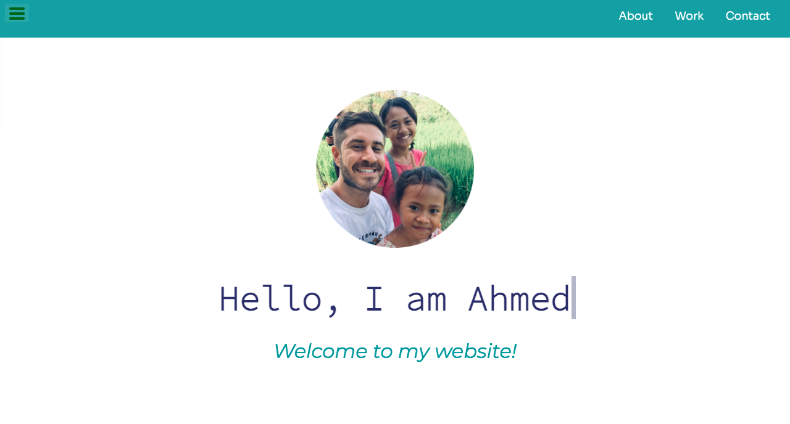

# Personal-Portofolio

This is a solution to [Build a Personal Portfolio Webpage](https://www.freecodecamp.org/learn/responsive-web-design/responsive-web-design-projects/build-a-personal-portfolio-webpage). 

## Links :

- Solution URL: [https://github.com/macdeesh/Personal-Portofolio]
- Live Site URL: [https://macdeesh.github.io/Personal-Portofolio/]

## Screenshot :




## What I made :

- In this project, I start using The ```:root``` pseudo-class for declaring global CSS variables :
```css
:root {
  --blue-color: #292C6D;
  --cayan-color: #11999E;
  --white-color: #ffffff;
  --bar-bg-color: #11999eed;
}

h2 {
color: var(--blue-color);
}

```
- I made a navbar, always at the top of the viewport, with items in the right :

```css
.navbar {
  display: flex;
  flex-direction: row-reverse;
  background-color: var(--bar-bg-color);
  position: fixed;
  width: 100%; 
  z-index: 3;
}

li {
  display: inline-block;
  margin-right: 2rem;
}
```

- Then I made the navbar responsive collapse, by making hamburger menu in ```@media (max-width:700px)``` 
  and adding ```<input type="checkbox" id="check">``` to the HTML 
  with ```<label for="check" class="nav-button"><i class="fa-solid fa-bars"></i></label>```. 
  Then for the styling I made the checkbox hidden ```#check { display: none; }``` and i changed the position of the ```nav-list``` 
  and put a ```transform & transition```. I created :checked pseudo-class selector for the id of the input to make an effect 
  using ```transform & transition```, to the ```nav-list``` and to his item which is the ```li``` 
  and made a style to check-box button: 
  
```css
.nav-list {
    top: 100%;
    position: absolute;
    float: right;
    text-align: center;
    display: block;
    width: 100%;
    background-color: var(--cayan-color);
    margin: 0;
    transform: scale(1, 0);
    transform-origin: top;
    transition: transform 400ms ease-in-out;
  }

  .nav-list li {
    opacity: 0;
    display: block;
    margin: 1rem 0;
    transition: opacity 150ms ease-in-out;
  }

  .nav-button {
    display: block;
    font-size: 2rem;
    color: var(--white-color);
    cursor: pointer;
    margin: 0.5rem 2rem;
  }

  #check:checked~.nav-list {
    transform: scale(1, 1);
  }

  #check:checked~.nav-list li {
    opacity: 1;
    transition: opacity 0.5s ease-in-out 250ms;
  }
  ```
  
  - I made also a hover effect to nav-bar with a little animation :
  
```css
.navbar a::after {
  content: "";
  position: absolute;
  right: 0;
  bottom: 0;
  width: 0;
  height: 2px;
  background-color: var(--white-color);
  transition: width 0.25s ease-out;
}

.navbar a:hover {
  text-shadow: 0px 0px 12px var(--white-color);
}

.navbar a:hover::after {
  width: 100%;
  left: 0;
  right: auto;
}
```
  
  - For the welcome section, I made a height equal to the viewport using ```height: 100vh;```, and I made type write animation to the title and the 
    paragraphe :
    
```css
.title {
  position: relative;
  width: max-content;
  font-family: 'Source Code Pro', monospace;
}

.subtitle {
  color: var(--cayan-color);
  opacity: 0;
  transform: translateY(3rem);
  animation: fadeInUp 2s ease calc(var(--typewriterSpeed) + 2s) forwards;
}

.title::before,
.title::after {
  content: "";
  position: absolute;
  top: 0;
  right: 0;
  bottom: 0;
  left: 0;
}

.title::before {
  background: var(--white-color);
  animation: typewriter var(--typewriterSpeed) steps(var(--typewriterCharacters)) 1s forwards;
}

.title::after {
  width: 0.124em;
  background: var(--blue-color);
  animation: typewriter var(--typewriterSpeed) steps(var(--typewriterCharacters)) 1s forwards,
             blink 850ms steps(var(--typewriterCharacters)) infinite;
}

@keyframes typewriter {
  to {
    left: 100%;
  }
}

@keyframes blink {
  to {
    background: transparent;
  }
}

@keyframes fadeInUp {
  to {
    opacity: 1;
    transform: translateY(0);
  }
}
```

- For the card container I made a responsive grid of 6 cards with 3 columns using ```grid-template-columns```, inside every card there is an image of a project with a responsive high :

```css
.grid-container {
  display: grid;
  grid-template-columns: repeat(auto-fit, minmax(300px, 1fr));
  grid-gap: 2rem;
  align-items: center;
  justify-content: center;
  margin: 2rem 2rem 4rem;
}

.project-image {
  height: calc(100% - 7rem);
  max-width: 100%;
  margin-bottom: 0.5rem;
}
```

- Finally for the contact section I made links, working as button, to my contact pages with a hover animation :

```css
.contact-section a {
  text-decoration: none;
  color: var(--blue-color);
  font-size: 1.3rem;
  margin-right: 3rem;
  display: inline-block;
  transition: transform 0.3s ease-out;
}

.contact-section a:hover {
  transform: translateY(5px);
  text-shadow: 0px 0px 14px var(--contact-hover-color);
  box-sizing: inherit;
}
```

## Author :

 - Github - [Macdeesh](https://github.com/macdeesh)
 - Twitter - [@Macdiish](https://twitter.com/Macdiish)
